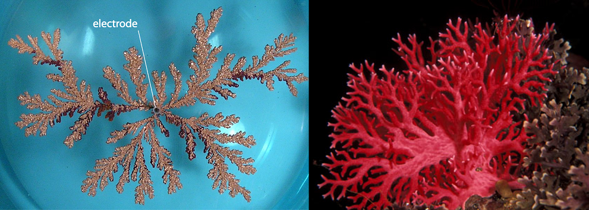

# Cellular Automata Assignment: Diffusion-Limited Aggregation

Diffusion-limited aggregation (DLA) is the process whereby particles undergoing a random walk due to Brownian motion cluster together to form aggregates of such particles. This model was proposed to simulate certain types of aggregation, for instance metal ions diffusing through a fluid and sticking to a charged electrode. “Diffusion” because the particles forming the structure, also called Brownian tree or cluster, wander around randomly before attaching themselves (“aggregating”) to the structure. “Diffusion-limited” because the particles are considered to be in low concentrations and therefore don’t inter- act together. Other examples can be found in non-living and living nature, e.g. mineral deposition, snowflake growth, lightning paths or corals growth.

Figure 1: (left) DLA structure grown from a copper sulfate solution in an electrodeposition cell. (right) Red coral Errina novaezelandiae in the Te Awaatu Marine Reserve in Fiordland.

## Cellular Automaton

The goal of this exercise is to implement a two-dimensional CA that mimics a DLA process. Launch Octave (or Matlab), open ca.m and run it.  Have a look at the content of the file to become familiar with the main variables (top part). The automaton space is formed by an array of cells, which size is given by the integer parameters nx and ny. The x-axis represents the vertical axis and the y-axis the horizontal axis.  Motionless, non-interacting particles (blue cells) are initially present in the CA space. Their density can be changed through the variable *particlesDensity*.

Figure 6: First run of ca.m.  The above automaton space is defined by an array of
40x40 cells. Motionless particles (in blue) are initially present in the environment.

****
