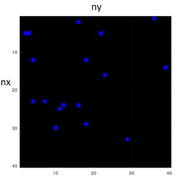

# Cellular Automata Assignment: Diffusion-Limited Aggregation

Diffusion-limited aggregation (DLA) is the process whereby particles undergoing a random walk due to Brownian motion cluster together to form aggregates of such particles. This model was proposed to simulate certain types of aggregation, for instance metal ions diffusing through a fluid and sticking to a charged electrode. “Diffusion” because the particles forming the structure, also called Brownian tree or cluster, wander around randomly before attaching themselves (“aggregating”) to the structure. “Diffusion-limited” because the particles are considered to be in low concentrations and therefore don’t inter- act together. Other examples can be found in non-living and living nature, e.g. mineral deposition, snowflake growth, lightning paths or corals growth.


Figure 1: (left) DLA structure grown from a copper sulfate solution in an electrodeposition cell. (right) Red coral Errina novaezelandiae in the Te Awaatu Marine Reserve in Fiordland.

## Cellular Automaton

The goal of this exercise is to implement a two-dimensional CA that mimics a DLA process. Launch Octave (or Matlab), open ca.m and run it.  Have a look at the content of the file to become familiar with the main variables (top part). The automaton space is formed by an array of cells, which size is given by the integer parameters nx and ny. The x-axis represents the vertical axis and the y-axis the horizontal axis.  Motionless, non-interacting particles (blue cells) are initially present in the CA space. Their density can be changed through the variable *particlesDensity*.



Figure 2: First run of ca.m.  The above automaton space is defined by an array of
40x40 cells. Motionless particles (in blue) are initially present in the environment.

** Implementation of a Pseudo Brownian Motion

This section describes how to obtain particles that undergo a random walk. These particles are assumed to be in low concentrations, so no interaction between them are modeled.

Start by setting in the code the number of time steps to T=7000. Run ca.m and observe the motion of the particles. Note that you can speed up or slow down the walk
of the particles by adjusting the parameter delay. You can also change the size of the
automaton space (nx and ny must be divisible by 2) or resize the window to get a better visibility. Try to qualify the movement of the particles. 
```diff
- What kind of neighborhood is implemented? 
- Does the observed motion feature some randomness? If it's possible, find the deterministic and random components of the motion.
```

Try to understand what does the code between the tags “Pseudo Brownian motion" and “End". The automaton space is divided into blocks of 2x2 cells inside which the position of the particles is updated. At each time step, two random, complementary matrices containing “0" and “1" elements are generated (cw and ccw). 
```diff
- With your understanding of the code, find and draw the updated position of the particles at time t+1 for the initial configuration of the following 4x4 CA. 
```
Consider vectors xind =yind = [1, 3] which define the indexes of the upper-left cell of each block, and black cells below to represent particles and/or “1" matrix elements.
(Hint: only the elements in cw that are defined by xind and yind are used, that are here cw(1, 1), cw(3, 1), cw(1,3), and cw(3,3).)

****
